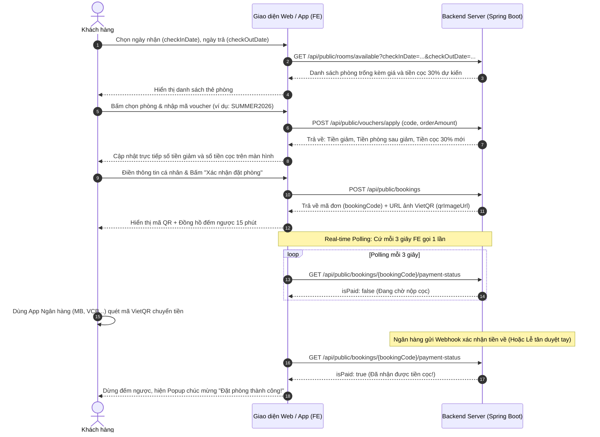
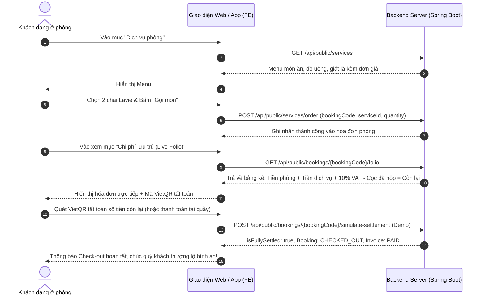

# TÀI LIỆU HƯỚNG DẪN TÍCH HỢP API DÀNH CHO FRONTEND TEAM

**Dự án:** Hệ thống Quản lý Khách sạn & Đặt phòng Trực tuyến (PBL6)  
**Phiên bản:** 1.0 - Backend Spring Boot RESTful API  
**Cập nhật lần cuối:** 21/09/2026

---

## MỤC LỤC

1. [Quy chuẩn Kết nối Chung](#1-quy-chuẩn-kết-nối-chung)
2. [Tài khoản Thử nghiệm Mẫu](#2-tài-khoản-thử-nghiệm-mẫu)
3. [Sơ đồ Luồng Tích hợp Giao diện (UI Flows)](#3-sơ-đồ-luồng-tích-hợp-giao-diện-ui-flows)
4. [Chi tiết API Phân hệ Khách hàng (Public & Customer)](#4-chi-tiết-api-phân-hệ-khách-hàng)
   - 4.1. [Xác thực & Tài khoản (`/api/auth`)](#41-xác-thực--tài-khoản)
   - 4.2. [Tìm kiếm & Xem Phòng (`/api/public/rooms`)](#42-tìm-kiếm--xem-phòng)
   - 4.3. [Khuyến mãi & Voucher (`/api/public/vouchers`)](#43-khuyến-mãi--voucher)
   - 4.4. [Đặt phòng & Chuyển khoản VietQR (`/api/public/bookings`)](#44-đặt-phòng--chuyển-khoản-vietqr)
   - 4.5. [Gọi Dịch vụ Lưu trú & Live Folio (`/api/public/services`, `/folio`)](#45-gọi-dịch-vụ-lưu-trú--live-folio)
   - 4.6. [Tra cứu Lịch sử Đặt phòng (`/api/public/history`, `/api/customer`)](#46-tra-cứu-lịch-sử-đặt-phòng)
5. [Chi tiết API Phân hệ Nhân viên & Quản trị (Staff & Admin)](#5-chi-tiết-api-phân-hệ-nhân-viên--quản-trị)
   - 5.1. [Duyệt cọc, Check-in, Order dịch vụ, Quyết toán Checkout](#51-nghiệp-vụ-lễ-tân--thu-ngân)
   - 5.2. [Quản lý Voucher Khuyến mãi (Admin)](#52-quản-lý-voucher-admin)
6. [Quy ước Mã Lỗi HTTP & Xử lý Thông báo](#6-quy-ước-mã-lỗi-http)

---

## 1. QUY CHUẨN KẾT NỐI CHUNG

- **Base URL Backend Local:** `http://localhost:9090`
- **Content-Type Mặc định:** `application/json`
- **Cơ chế Xác thực (Auth Header):** Với các API yêu cầu đăng nhập, FE đính kèm JWT Token vào Header:
  ```http
  Authorization: Bearer <jwt_access_token>
  ```
- **Định dạng Response Thống nhất (ApiResponse Wrapper):**
  Toàn bộ các API đều trả về cấu trúc chuẩn sau:
  ```json
  {
    "success": true,           // true nếu thành công, false nếu có lỗi
    "message": "Thông báo thân thiện hiển thị cho người dùng",
    "data": { ... }            // Dữ liệu trả về (Object, Array hoặc null)
  }
  ```

---

## 2. TÀI KHOẢN THỬ NGHIỆM MẪU (TEST ACCOUNTS)

Mật khẩu mặc định cho tất cả tài khoản mẫu là: `123456`

| Username       | Role (Vai trò) | Mục đích sử dụng                                           |
| :------------- | :------------- | :--------------------------------------------------------- |
| `admin`        | `ADMIN`        | Quản trị hệ thống toàn quyền, quản lý voucher, cài đặt giá |
| `manager`      | `MANAGER`      | Quản lý khách sạn, thống kê báo cáo doanh thu              |
| `receptionist` | `RECEPTIONIST` | Lễ tân: Check-in, Duyệt cọc tay, Hủy phòng hoàn cọc        |
| `cashier`      | `CASHIER`      | Thu ngân: Xem Folio, Thu tiền tất toán khi Checkout        |
| `housekeeper`  | `HOUSEKEEPING` | Buồng phòng: Nhận phòng dọn dẹp, đổi trạng thái phòng      |
| `customer1`    | `CUSTOMER`     | Khách hàng thành viên đã có tài khoản (SĐT: `0901234567`)  |

---

## 3. SƠ ĐỒ LUỒNG TÍCH HỢP GIAO DIỆN (UI FLOWS)

### Luồng 1: Khách Tìm phòng $\rightarrow$ Nhập Voucher $\rightarrow$ Quét VietQR Cọc 30%



---

### Luồng 2: Khách đang ở phòng $\rightarrow$ Gọi Món F&B $\rightarrow$ Live Folio $\rightarrow$ Quyết toán Check-out



---

## 4. CHI TIẾT API PHÂN HỆ KHÁCH HÀNG

### 4.1. Xác thực & Tài khoản

#### [POST] `/api/auth/login`

- **Mục đích:** Đăng nhập lấy JWT Token.
- **Quyền:** Public.
- **Request Body:**
  ```json
  {
    "username": "customer1",
    "password": "123456"
  }
  ```
- **Response Thành công (200 OK):**
  ```json
  {
    "success": true,
    "message": "Đăng nhập thành công",
    "data": {
      "accessToken": "eyJhbGciOiJIUzI1NiJ9...",
      "tokenType": "Bearer",
      "accountId": 6,
      "username": "customer1",
      "fullName": "Nguyễn Văn Khách",
      "email": "customer1@gmail.com",
      "phone": "0901234567",
      "role": "CUSTOMER"
    }
  }
  ```

#### [POST] `/api/auth/register`

- **Mục đích:** Đăng ký tài khoản khách hàng mới (`role = CUSTOMER`).
- **Quyền:** Public.
- **Request Body:**
  ```json
  {
    "username": "khachmoi",
    "password": "123456",
    "fullName": "Hoàng Nam",
    "email": "nam.hoang@gmail.com",
    "phone": "0912999888"
  }
  ```

---

### 4.2. Tìm kiếm & Xem Phòng

#### [GET] `/api/public/rooms/room-types`

- **Mục đích:** Lấy danh sách các loại phòng và giá tiêu chuẩn để hiển thị trang chủ.
- **Quyền:** Public.

#### [GET] `/api/public/rooms/available`

- **Mục đích:** Tìm phòng trống theo khoảng thời gian và bộ lọc giá.
- **Quyền:** Public.
- **Query Parameters:**
  | Tên tham số | Kiểu | Bắt buộc | Mô tả | Ví dụ |
  | :--- | :--- | :--- | :--- | :--- |
  | `checkInDate` | String | **Có** | Ngày nhận phòng (`YYYY-MM-DD`) | `2026-10-01` |
  | `checkOutDate` | String | **Có** | Ngày trả phòng (`YYYY-MM-DD`) | `2026-10-03` |
  | `guestCount` | Integer | Không | Số khách (Mặc định: 1) | `2` |
  | `minPrice` | Number | Không | Lọc giá tối thiểu | `500000` |
  | `maxPrice` | Number | Không | Lọc giá tối đa | `1500000` |
  | `sortBy` | String | Không | Sắp xếp: `PRICE_ASC` hoặc `PRICE_DESC` | `PRICE_ASC` |
- **Response Thành công:**
  ```json
  {
    "success": true,
    "message": "Tìm thấy 2 phòng khả dụng",
    "data": [
      {
        "roomId": 101,
        "roomNumber": "101",
        "floor": 1,
        "roomTypeName": "Phòng Standard",
        "capacity": 2,
        "basePrice": 500000,
        "amenities": "Wifi tốc độ cao, TV, Điều hòa hai chiều",
        "nights": 2,
        "totalRoomCharge": 1000000,
        "depositPercentage": 30,
        "depositRequired": 300000
      }
    ]
  }
  ```

---

### 4.3. Khuyến mãi & Voucher

#### [GET] `/api/public/vouchers`

- **Mục đích:** Lấy danh sách các mã ưu đãi đang chạy để hiển thị cho khách chọn nhanh.
- **Quyền:** Public.
- **Response Thành công:**
  ```json
  {
    "success": true,
    "data": [
      {
        "voucherId": 1,
        "code": "SUMMER2026",
        "voucherName": "Ưu đãi chào hè giảm 10% tối đa 200.000đ",
        "discountType": "PERCENTAGE",
        "discountValue": 10,
        "maxDiscountAmount": 200000,
        "minOrderAmount": 500000,
        "endDate": "2026-12-31"
      },
      {
        "voucherId": 2,
        "code": "WELCOME50K",
        "voucherName": "Mã chào mừng khách mới giảm 50.000đ",
        "discountType": "FIXED_AMOUNT",
        "discountValue": 50000,
        "minOrderAmount": 300000,
        "endDate": "2026-12-31"
      }
    ]
  }
  ```

#### [POST] `/api/public/vouchers/apply`

- **Mục đích:** Khách nhập mã voucher để kiểm tra và xem trước số tiền giảm trước khi bấm đặt.
- **Quyền:** Public.
- **Request Body:**
  ```json
  {
    "code": "SUMMER2026",
    "orderAmount": 1000000
  }
  ```
- **Response Thành công:**
  ```json
  {
    "success": true,
    "message": "Áp dụng mã ưu đãi thành công! Bạn được giảm 100.000đ.",
    "data": {
      "isValid": true,
      "code": "SUMMER2026",
      "voucherName": "Ưu đãi chào hè giảm 10% tối đa 200.000đ",
      "originalAmount": 1000000,
      "discountAmount": 100000,
      "finalAmount": 900000,
      "newDepositRequired": 270000
    }
  }
  ```

---

### 4.4. Đặt phòng & Chuyển khoản VietQR

#### [POST] `/api/public/bookings`

- **Mục đích:** Tạo đơn đặt phòng, tự động sinh mã VietQR Napas ngân hàng thực tế.
- **Quyền:** Public (Nếu khách đã đăng nhập, FE có thể truyền kèm `Authorization: Bearer <token>` để tự động gắn vào tài khoản khách).
- **Request Body:**
  ```json
  {
    "roomId": 101,
    "checkInDate": "2026-10-01",
    "checkOutDate": "2026-10-03",
    "guestCount": 2,
    "fullName": "Nguyễn Văn Khách",
    "phone": "0901234567",
    "email": "khach@gmail.com",
    "idType": "CCCD",
    "idNumber": "048202001234",
    "nationality": "Việt Nam",
    "voucherCode": "SUMMER2026",
    "note": "Khách đến nhận phòng lúc 14h"
  }
  ```
- **Response Thành công:**
  ```json
  {
    "success": true,
    "message": "Khởi tạo đơn đặt phòng thành công. Vui lòng chuyển khoản tiền cọc để xác nhận giữ chỗ.",
    "data": {
      "bookingCode": "BK-20260921-A1B2",
      "customerName": "Nguyễn Văn Khách",
      "customerPhone": "0901234567",
      "roomNumber": "101",
      "roomTypeName": "Phòng Standard",
      "checkInDate": "2026-10-01",
      "checkOutDate": "2026-10-03",
      "nights": 2,
      "totalRoomCharge": 900000,
      "depositRequired": 270000,
      "status": "PENDING_DEPOSIT",
      "qrCode": {
        "qrImageUrl": "https://img.vietqr.io/image/MB-090123456789-compact2.png?amount=270000&addInfo=PBL6+BK-20260921-A1B2&accountName=KHACH+SAN+PBL6+HOTEL",
        "bankId": "MB",
        "accountNo": "090123456789",
        "accountName": "KHACH SAN PBL6 HOTEL",
        "amount": 270000,
        "transferContent": "PBL6 BK-20260921-A1B2",
        "timeoutMinutes": 15,
        "expiredAt": "2026-09-21T21:45:00"
      }
    }
  }
  ```

#### [GET] `/api/public/bookings/{bookingCode}/payment-status`

- **Mục đích:** FE gọi Polling mỗi 3 giây để kiểm tra tiền cọc đã về chưa.
- **Quyền:** Public.
- **Response khi ĐÃ NHẬN ĐƯỢC TIỀN CỌC:**
  ```json
  {
    "success": true,
    "data": {
      "bookingCode": "BK-20260921-A1B2",
      "bookingStatus": "CONFIRMED",
      "depositRequired": 270000,
      "depositPaid": 270000,
      "isPaid": true,
      "message": "Đã thanh toán tiền cọc thành công!"
    }
  }
  ```

#### [POST] `/api/public/bookings/{bookingCode}/simulate-deposit`

- **Mục đích:** API giả lập chuyển tiền cọc thành công (Dành cho FE test hoặc demo khi thuyết trình).
- **Quyền:** Public.

---

### 4.5. Gọi Dịch vụ Lưu trú & Live Folio

#### [GET] `/api/public/services`

- **Mục đích:** Xem menu dịch vụ ăn uống, giặt ủi, minibar.
- **Quyền:** Public.
- **Query Parameter:** `categoryId` (tùy chọn: lọc theo danh mục).

#### [POST] `/api/public/services/order`

- **Mục đích:** Khách đang ở phòng gọi dịch vụ phát sinh.
- **Quyền:** Public.
- **Request Body:**
  ```json
  {
    "bookingCode": "BK-20260921-A1B2",
    "serviceId": 1,
    "quantity": 2,
    "note": "Mang lên phòng 101"
  }
  ```

#### [GET] `/api/public/bookings/{bookingCode}/folio`

- **Mục đích:** Tra cứu hóa đơn chi tiết trực tiếp theo thời gian thực (Live Folio).
- **Quyền:** Public.
- **Response:**
  ```json
  {
    "success": true,
    "data": {
      "bookingCode": "BK-20260921-A1B2",
      "bookingStatus": "CHECKED_IN",
      "customerName": "Nguyễn Văn Khách",
      "roomNumber": "101",
      "roomCharge": 1000000,
      "serviceCharge": 30000,
      "subtotal": 1030000,
      "taxRate": 10.0,
      "taxAmount": 103000,
      "totalAmount": 1133000,
      "depositPaid": 300000,
      "remainingBalance": 833000,
      "isFullySettled": false,
      "services": [
        {
          "usageId": 1,
          "serviceName": "Nước suối Lavie",
          "quantity": 2,
          "unitPriceApplied": 15000,
          "totalPrice": 30000,
          "usedAt": "2026-10-01T15:30:00"
        }
      ],
      "settlementQr": {
        "qrImageUrl": "https://img.vietqr.io/image/MB-090123456789-compact2.png?amount=833000&addInfo=PBL6+SETTLE+BK-20260921-A1B2...",
        "amount": 833000,
        "transferContent": "PBL6 SETTLE BK-20260921-A1B2"
      }
    }
  }
  ```

---

### 4.6. Tra cứu Lịch sử Đặt phòng

#### [GET] `/api/public/history/lookup?phone=0901234567`

- **Mục đích:** Khách vãng lai (không cần tài khoản) nhập Số điện thoại để tra cứu toàn bộ các lần lưu trú của mình.
- **Quyền:** Public.
- **Query Parameter:** `phone` (Bắt buộc), `status` (Tùy chọn: `ALL`, `CONFIRMED`, `CHECKED_IN`, `CHECKED_OUT`, `CANCELED`).

#### [GET] `/api/public/history/lookup/{bookingCode}?phone=0901234567`

- **Mục đích:** Xem chi tiết 1 đơn lưu trú của khách vãng lai (Bảo mật: bắt buộc SĐT phải khớp).
- **Quyền:** Public.

#### [GET] `/api/customer/bookings/history`

- **Mục đích:** Khách thành viên (đã đăng nhập) xem lịch sử tất cả các chuyến đi của mình.
- **Quyền:** Yêu cầu đăng nhập (`Authorization: Bearer <token>`).
- **Query Parameter:** `status` (Tùy chọn).

---

## 5. CHI TIẾT API PHÂN HỆ NHÂN VIÊN & QUẢN TRỊ (STAFF & ADMIN)

> **Lưu ý:** Toàn bộ các API dưới đây bắt buộc phải có Header:  
> `Authorization: Bearer <staff_jwt_token>`

### 5.1. Nghiệp vụ Lễ tân & Thu ngân

| Method | Endpoint                                                        | Vai trò cho phép              | Mục đích                                                              |
| :----- | :-------------------------------------------------------------- | :---------------------------- | :-------------------------------------------------------------------- |
| `POST` | `/api/staff/bookings/{bookingCode}/confirm-deposit`             | Lễ tân, Thu ngân, Admin       | Duyệt cọc thủ công khi khách chuyển khoản trực tiếp hoặc lỗi webhook  |
| `POST` | `/api/staff/billing/bookings/{bookingCode}/check-in`            | Lễ tân, Manager, Admin        | Check-in đón khách vào phòng (Phòng đổi sang `OCCUPIED`)              |
| `POST` | `/api/staff/billing/bookings/{bookingCode}/order-service`       | Lễ tân, Thu ngân, Buồng phòng | Ghi nhận dịch vụ phát sinh vào phòng khách                            |
| `GET`  | `/api/staff/billing/bookings/{bookingCode}/folio`               | Thu ngân, Lễ tân, Admin       | Xem chi tiết bảng kê hóa đơn phòng                                    |
| `POST` | `/api/staff/billing/bookings/{bookingCode}/settle-and-checkout` | Thu ngân, Lễ tân, Admin       | Tất toán (Tiền mặt/Chuyển khoản) và Check-out (Phòng sang `CLEANING`) |
| `POST` | `/api/staff/billing/bookings/{bookingCode}/cancel-with-refund`  | Lễ tân, Manager, Admin        | Hủy đơn và tự động hoàn tiền cọc (>=3 ngày: 100%, 1-2 ngày: 50%)      |

---

### 5.2. Quản lý Voucher (Admin)

| Method  | Endpoint                          | Request Body                                                                                                            | Mục đích                                       |
| :------ | :-------------------------------- | :---------------------------------------------------------------------------------------------------------------------- | :--------------------------------------------- |
| `GET`   | `/api/admin/vouchers`             | Không                                                                                                                   | Xem tất cả voucher và thống kê số lượt đã dùng |
| `POST`  | `/api/admin/vouchers`             | `{ code, voucherName, discountType, discountValue, maxDiscountAmount, minOrderAmount, startDate, endDate, usageLimit }` | Tạo voucher ưu đãi mới                         |
| `PATCH` | `/api/admin/vouchers/{id}/toggle` | Không                                                                                                                   | Bật / Tắt trạng thái hoạt động của voucher     |

---

## 6. QUY ƯỚC MÃ LỖI HTTP & XỬ LÝ TRÊN GIAO DIỆN

Khi Backend trả về lỗi, HTTP Status Code sẽ khác `200`, và body trả về luôn có định dạng:

```json
{
  "success": false,
  "message": "Nội dung lỗi chi tiết bằng tiếng Việt",
  "data": null
}
```

FE chỉ cần lấy `response.data.message` để hiển thị Toast thông báo / Alert cho người dùng:

| Mã HTTP | Tên lỗi            | Trường hợp xảy ra & Cách xử lý ở FE                                                                                                                                                                       |
| :------ | :----------------- | :-------------------------------------------------------------------------------------------------------------------------------------------------------------------------------------------------------- |
| `400`   | **BAD REQUEST**    | Dữ liệu gửi lên không hợp lệ (Ví dụ: Ngày trả phòng trước ngày nhận phòng, phòng đã có người đặt, voucher hết hạn hoặc chưa đạt giá trị tối thiểu). FE hiển thị Toast lỗi đỏ với thông điệp từ `message`. |
| `401`   | **UNAUTHORIZED**   | Chưa truyền Token hoặc Token đã hết hạn. FE xóa Token cũ trong `localStorage` và chuyển hướng về màn hình Đăng nhập.                                                                                      |
| `403`   | **FORBIDDEN**      | Tài khoản không có quyền truy cập (Ví dụ: Khách hàng cố gọi API của Lễ tân). FE hiển thị thông báo "Bạn không có quyền thực hiện chức năng này".                                                          |
| `404`   | **NOT FOUND**      | Không tìm thấy mã phòng hoặc mã đơn đặt phòng. FE hiển thị trang "Không tìm thấy dữ liệu".                                                                                                                |
| `500`   | **INTERNAL ERROR** | Lỗi hệ thống Backend. FE hiển thị "Hệ thống đang bận, vui lòng thử lại sau".                                                                                                                              |

---

_Chúc các bạn Frontend Team tích hợp giao diện nhanh chóng và thành công!_
